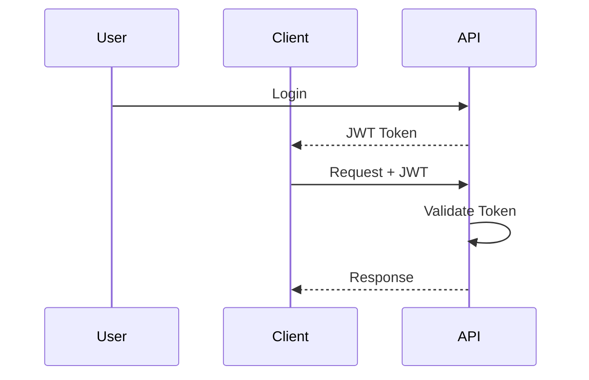

# JWT Authentication

JWT authentication stores authentication data inside a signed token.

```mermaid
sequenceDiagram

participant User
participant Client
participant API

User->>API: Login
API-->>Client: JWT Token

Client->>API: Request + JWT

API->>API: Validate Token

API-->>Client: Response
```
