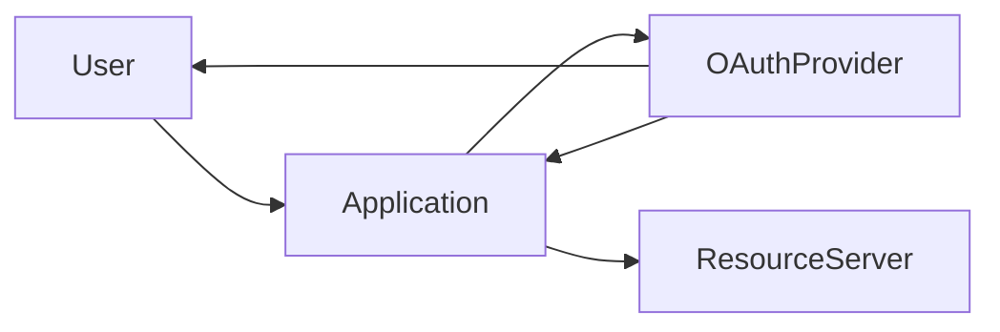

# OAuth Overview

OAuth allows users to authorize applications using third-party identity providers.

```mermaid
flowchart LR

User --> Application
Application --> OAuthProvider
OAuthProvider --> User
OAuthProvider --> Application
Application --> ResourceServer
```
