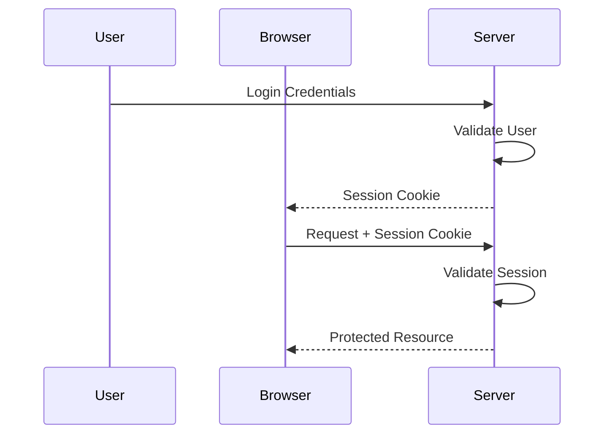

# Session Authentication

Session-based authentication stores user state on the server.

```mermaid
sequenceDiagram

participant User
participant Browser
participant Server

User->>Server: Login Credentials
Server->>Server: Validate User
Server-->>Browser: Session Cookie

Browser->>Server: Request + Session Cookie
Server->>Server: Validate Session
Server-->>Browser: Protected Resource
```
