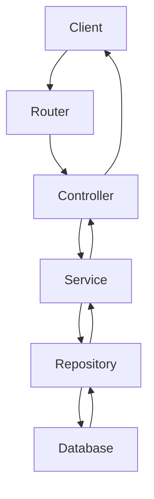

# API Request Flow

This diagram illustrates how a typical API request travels through backend layers.

```mermaid
flowchart TD

Client --> Router
Router --> Controller
Controller --> Service
Service --> Repository
Repository --> Database

Database --> Repository
Repository --> Service
Service --> Controller
Controller --> Client
```
