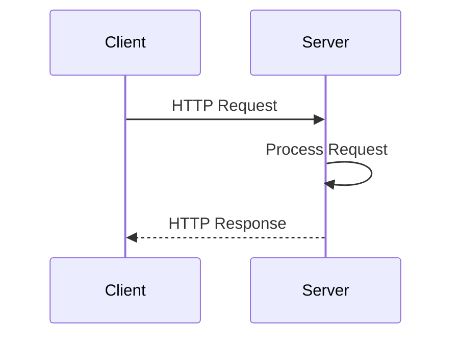

# Client Server Communication

This diagram shows the fundamental request-response model used by web applications.

```mermaid
sequenceDiagram

participant Client
participant Server

Client->>Server: HTTP Request
Server->>Server: Process Request
Server-->>Client: HTTP Response
```
