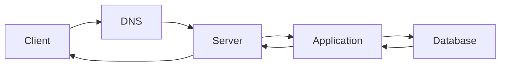

# HTTP Request Lifecycle

The following diagram illustrates the typical lifecycle of an HTTP request from a client to a backend system and back.

```mermaid
flowchart LR

Client --> DNS
DNS --> Server
Server --> Application
Application --> Database
Database --> Application
Application --> Server
Server --> Client
```
