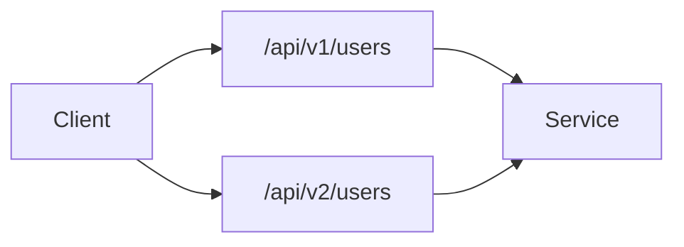

# API Versioning

Versioning allows APIs to evolve without breaking existing clients.

```mermaid
flowchart LR

Client --> v1["/api/v1/users"]

Client --> v2["/api/v2/users"]

v1 --> Service
v2 --> Service
```
