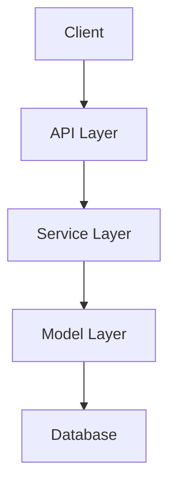

# Layered Architecture

A layered architecture separates responsibilities into distinct components.

```mermaid
flowchart TD

Client

API["API Layer"]

Service["Service Layer"]

Model["Model Layer"]

Database["Database"]

Client --> API
API --> Service
Service --> Model
Model --> Database
```
