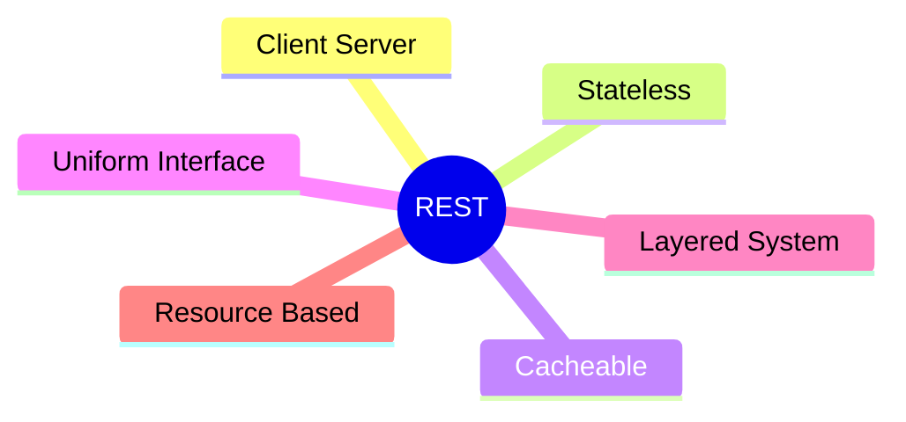

# REST Principles

REST APIs follow a set of architectural constraints.

```mermaid
mindmap
  root((REST))
    Client Server
    Stateless
    Cacheable
    Uniform Interface
    Layered System
    Resource Based
```
